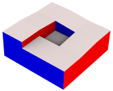

# Nightmare of polycubes

(Very) challenging 3D shapes for polycube-based hex-meshing

## Files

All models were designed with the [Shaper](https://www.salome-platform.org/?page_id=327) module of the open-source [SALOME platform](https://www.salome-platform.org/). For each of them, you can download the study (.hdf) and the exported Python script, STEP, B-Rep and STL files.

 
How to load a .hdf study file in SALOME?

In the menu bar, click on "File" > "Open", select the .hdf file, then open the Shaper module.

 
How to load a .py Shaper script in SALOME?

First, open the Shaper module, then in the menu bar click on "File" > "Load Script" and select the .py file.

For STL files I used the default relative deflection of 0.0001.

Name | Thumbnail | Files | Comments
-----|-----------|-------|---------
`encrusted_cube` | 
 <a href="https://3dviewer.net/#model=https://github.com/LIHPC-Computational-Geometry/nightmare_of_polycubes/blob/main/encrusted_cube/labeled_mesh.glb" target="_blank" rel="noopener noreferrer">3D viewer ↗</a>
 | [.hdf](encrusted_cube/SALOME_Study.hdf)   [.py](encrusted_cube/SALOME_Shaper.py)   [.step](encrusted_cube/CAD.step)   [.brep](encrusted_cube/CAD.brep)   [.stl](encrusted_cube/CAD.stl)   [.obj](encrusted_cube/triangle_mesh.obj) | The labeling is justly classified as invalid (there are 4-connected corners with incident boundaries of the same axis) according to the "simple orthogonal polyhedra" criteria [^5][^1]. But the issue is that the common processing for invalid corners (local relabeling) will result in a high distorsion, whereas a global operator (retracing of incident boundaries) would be better. Model inspired by ABC n°00001525 [^6].
`cuboid_screw_thread` | 
 <a href="https://3dviewer.net/#model=https://github.com/LIHPC-Computational-Geometry/nightmare_of_polycubes/blob/main/cuboid_screw_thread/labeled_mesh.glb" target="_blank" rel="noopener noreferrer">3D viewer ↗</a>
 | [.hdf](cuboid_screw_thread/SALOME_Study.hdf)   [.py](cuboid_screw_thread/SALOME_Shaper.py)   [.step](cuboid_screw_thread/CAD.step)   [.brep](cuboid_screw_thread/CAD.brep)   [.stl](cuboid_screw_thread/CAD.stl)   [.obj](cuboid_screw_thread/triangle_mesh.obj) | Introduced in [^2] and mentioned in appendices of [^3].   Labeling-based approaches [^1][^3] will collapse the two parts of the slope, constrained to the same top and bottom planes.
`cuboid_torus_with_step` | 
 <a href="https://3dviewer.net/#model=https://github.com/LIHPC-Computational-Geometry/nightmare_of_polycubes/blob/main/cuboid_torus_with_step/labeled_mesh.glb" target="_blank" rel="noopener noreferrer">3D viewer ↗</a>
 | [.hdf](cuboid_torus_with_step/SALOME_Study.hdf)   [.py](cuboid_torus_with_step/SALOME_Shaper.py)   [.step](cuboid_torus_with_step/CAD.step)   [.brep](cuboid_torus_with_step/CAD.brep)   [.stl](cuboid_torus_with_step/CAD.stl)   [.obj](cuboid_torus_with_step/triangle_mesh.obj) | Introduced in [^2] I believe.   Here too labeling-based approaches [^1][^3] will not detect any invalidity and crush the step into the z-axis plane.
`cuboid_tray_with_step` | 
 <a href="https://3dviewer.net/#model=https://github.com/LIHPC-Computational-Geometry/nightmare_of_polycubes/blob/main/cuboid_tray_with_step/labeled_mesh.glb" target="_blank" rel="noopener noreferrer">3D viewer ↗</a>
 | [.hdf](cuboid_tray_with_step/SALOME_Study.hdf)   [.py](cuboid_tray_with_step/SALOME_Shaper.py)   [.step](cuboid_tray_with_step/CAD.step)   [.brep](cuboid_tray_with_step/CAD.brep)   [.stl](cuboid_tray_with_step/CAD.stl)   [.obj](cuboid_tray_with_step/triangle_mesh.obj) | Similar to the previous model (the step will still be crushed), but of genus 0.
`in-volume_twist` | 
 <a href="https://3dviewer.net/#model=https://github.com/LIHPC-Computational-Geometry/nightmare_of_polycubes/blob/main/in-volume_twist/labeled_mesh.glb" target="_blank" rel="noopener noreferrer">3D viewer ↗</a>
 | [.hdf](in-volume_twist/SALOME_Study.hdf)   [.py](in-volume_twist/SALOME_Shaper.py)   [.step](in-volume_twist/CAD.step)   [.brep](in-volume_twist/CAD.brep)   [.stl](in-volume_twist/CAD.stl)   [.obj](in-volume_twist/triangle_mesh.obj) | Introduced in [^4]   Labeling-based approaches [^1][^3] will not detect the twist. The slits prevent hex-mesh extraction algorithms from un-twisting the through-hole and pushing all distorsion towards the left and right faces.
`in-volume_knot` | 
 <a href="https://3dviewer.net/#model=https://github.com/LIHPC-Computational-Geometry/nightmare_of_polycubes/blob/main/in-volume_knot/labeled_mesh.glb" target="_blank" rel="noopener noreferrer">3D viewer ↗</a>
 | [.hdf](in-volume_knot/SALOME_Study.hdf)   [.py](in-volume_knot/SALOME_Shaper.py)   [.step](in-volume_knot/CAD.step)   [.brep](in-volume_knot/CAD.brep)   [.stl](in-volume_knot/CAD.stl)   [.obj](in-volume_knot/triangle_mesh.obj) | Similar to the previous model, but the through-hole is twisting around itself.
`pipe_helix` |  | [.hdf](pipe_helix/SALOME_Study.hdf)   [.py](pipe_helix/SALOME_Shaper.py)   [.step](pipe_helix/CAD.step)   [.brep](pipe_helix/CAD.brep)   [.stl](pipe_helix/CAD.stl) | 
`pipe_helix_7` |  | [.hdf](pipe_helix_7/SALOME_Study.hdf)   [.py](pipe_helix_7/SALOME_Shaper.py)   [.step](pipe_helix_7/CAD.step)   [.brep](pipe_helix_7/CAD.brep)   [.stl](pipe_helix_7/CAD.stl) | 

> [!NOTE]
> To generate a mesh, you can use the [SMESH](https://www.salome-platform.org/?page_id=374) module of SALOME, which bundles open-source ([NETGEN](https://sourceforge.net/projects/netgen-mesher/), [GMSH](http://gmsh.info/)) and commercial ([3D Precise Mesh](https://www.spatial.com/products/3d-precise-mesh)) meshing tools.

Thanks to François Protais for the ideas and to Christophe Bourcier for the help.

## License

[CC BY-NC 4.0](https://creativecommons.org/licenses/by-nc/4.0/)

How to give attribution:
> "[Nightmare of polycubes](https://github.com/LIHPC-Computational-Geometry/nightmare_of_polycubes)" by Sébastien Mestrallet and Christophe Bourcier, licensed under [CC BY-NC 4.0](https://creativecommons.org/licenses/by-nc/4.0/)

[^1]: Marco Livesu, Nicholas Vining, Alla Sheffer, James Gregson, Riccardo Scateni, "PolyCut: Monotone Graph-Cuts for PolyCube Base-Complex Construction", _Transactions on Graphics_ (Proc. SIGGRAPH ASIA 2013), 2013, DOI: [10.1145/2508363.2508388](https://dl.acm.org/doi/10.1145/2508363.2508388), project page: [www.cs.ubc.ca/labs/imager/tr/2013/polycut/](http://www.cs.ubc.ca/labs/imager/tr/2013/polycut/)

[^2]: Dmitry Sokolov, Nicolas Ray, "Fixing normal constraints for generation of polycubes", research report, LORIA, 2015, HAL: [hal-01211408](https://inria.hal.science/hal-01211408)

[^3]: Corentin Dumery, François Protais, Sébastien Mestrallet, Christophe Bourcier, Franck Ledoux, "Evocube: a Genetic Labeling Framework for Polycube-Maps", _Computer Graphics Forum_, 2022, DOI: [10.1111/cgf.14649](http://doi.org/10.1111/cgf.14649), HAL: [hal-03657779](https://hal-cea.archives-ouvertes.fr/hal-03657779), project page: [corentindumery.github.io/projects/evocube.html](https://corentindumery.github.io/projects/evocube.html)

[^4]: Sébastien Mestrallet, François Protais, Christophe Bourcier, Franck Ledoux, "Limits and prospects of polycube labelings", _SIAM International Meshing Roundtable_ Workshop, March 2023, HAL: [cea-04169841](https://cea.hal.science/cea-04169841)

[^5]: David Eppstein, Elena Mumford, "Steinitz Theorems for Orthogonal Polyhedra", _Proceedings of the 26th annual symposium on Computational Geometry_, pp.429–438, 2010, DOI: [10.1145/1810959.1811030](http://doi.org/10.1145/1810959.1811030)

[^6]: Sebastian Koch, Albert Matveev, Zhongshi Jiang, Francis Williams, Alexey Artemov, Evgeny Burnaev, Marc Alexa, Denis Zorin, Daniele Panozzo, "ABC: A Big CAD Model Dataset For Geometric Deep Learning", _Computer Vision and Pattern Recognition_, DOI: [10.1109/CVPR.2019.00983](http://doi.org/10.1109/CVPR.2019.00983), project page: [deep-geometry.github.io/abc-dataset](https://deep-geometry.github.io/abc-dataset/)