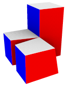
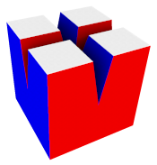
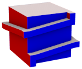
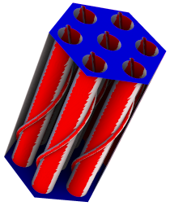
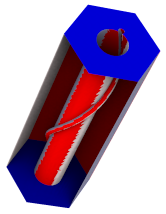

# Nightmare of polycubes

(Very) challenging 3D shapes for polycube-based hex-meshing

## Dataset

All models were designed with the [Shaper](https://www.salome-platform.org/?page_id=327) module of the open-source [SALOME platform](https://www.salome-platform.org/).

<!--
Yes, a HTML table would make things more readable, but we have to stick to a Markdown one to have [^footnotes]
https://docs.github.com/en/get-started/writing-on-github/getting-started-with-writing-and-formatting-on-github/basic-writing-and-formatting-syntax#footnotes
-->
Name | Thumbnail | Files | Comments
:---:|-----------|-------|---------
`7-connected` | <div align="center"><br/><a href="https://3dviewer.net/#model=https://github.com/LIHPC-Computational-Geometry/nightmare_of_polycubes/blob/main/7-connected/labeled_CAD.glb" target="_blank" rel="noopener noreferrer">3D viewer ↗</a></div> | [.hdf](7-connected/SALOME_Study.hdf) <br/> [.py](7-connected/SALOME_Shaper.py) <br/> [.step](7-connected/CAD.step) <br/> [.brep](7-connected/CAD.brep) <br/> [.stl](7-connected/CAD.stl) <br/> [.obj](7-connected/triangle_mesh.obj) | The node at the middle has 7 adjacent patches, which is usually forbidden [^5][^1][^3][^7], despite that the polycuboid corresponding to the labeling can be used to generate a good hex-mesh.
`8-connected` | <div align="center"><br/><a href="https://3dviewer.net/#model=https://github.com/LIHPC-Computational-Geometry/nightmare_of_polycubes/blob/main/8-connected/labeled_CAD.glb" target="_blank" rel="noopener noreferrer">3D viewer ↗</a></div> | [.hdf](8-connected/SALOME_Study.hdf) <br/> [.py](8-connected/SALOME_Shaper.py) <br/> [.step](8-connected/CAD.step) <br/> [.brep](8-connected/CAD.brep) <br/> [.stl](8-connected/CAD.stl) <br/> [.obj](8-connected/triangle_mesh.obj) | Another high valence corner (here of valence 8) is present in the labeling, but the latter can still be used to generate a good hex-mesh.
`24-connected` | <div align="center"><br/><a href="https://3dviewer.net/#model=https://github.com/LIHPC-Computational-Geometry/nightmare_of_polycubes/blob/main/24-connected/labeled_CAD.glb" target="_blank" rel="noopener noreferrer">3D viewer ↗</a></div> | [.hdf](24-connected/SALOME_Study.hdf) <br/> [.py](24-connected/SALOME_Shaper.py) <br/> [.step](24-connected/CAD.step) <br/> [.brep](24-connected/CAD.brep) <br/> [.stl](24-connected/CAD.stl) <br/> [.obj](24-connected/triangle_mesh.obj) | 8 volumes connected by a vertex, making a labeling node with 24 adjacent patches. If we ignore diagonal feature edges, the labeling can be used to generate a polycube-based hex-mesh.
`encrusted_cube` | <div align="center"><br/><a href="https://3dviewer.net/#model=https://github.com/LIHPC-Computational-Geometry/nightmare_of_polycubes/blob/main/encrusted_cube/labeled_CAD.glb" target="_blank" rel="noopener noreferrer">3D viewer ↗</a></div> | [.hdf](encrusted_cube/SALOME_Study.hdf) <br/> [.py](encrusted_cube/SALOME_Shaper.py) <br/> [.step](encrusted_cube/CAD.step) <br/> [.brep](encrusted_cube/CAD.brep) <br/> [.stl](encrusted_cube/CAD.stl) <br/> [.obj](encrusted_cube/triangle_mesh.obj) | The labeling is justly classified as invalid (there are 4-connected corners with incident boundaries of the same axis) according to the "simple orthogonal polyhedra" criteria [^5][^1]. But the issue is that the common processing for invalid corners (local relabeling [^3]) will result in a high distorsion, whereas a global operator (retracing of incident boundaries) would be better. Model inspired by ABC n°00001525 [^6].
`conjoined_twins` | <div align="center"><br/><a href="https://3dviewer.net/#model=https://github.com/LIHPC-Computational-Geometry/nightmare_of_polycubes/blob/main/conjoined_twins/labeled_CAD.glb" target="_blank" rel="noopener noreferrer">3D viewer ↗</a></div> | [.hdf](conjoined_twins/SALOME_Study.hdf) <br/> [.py](conjoined_twins/SALOME_Shaper.py) <br/> [.step](conjoined_twins/CAD.step) <br/> [.brep](conjoined_twins/CAD.brep) <br/> [.stl](conjoined_twins/CAD.stl) <br/> [.obj](conjoined_twins/triangle_mesh.obj) | Simplified configuration of the previous model.
`cuboid_screw_thread` | <div align="center"><br/><a href="https://3dviewer.net/#model=https://github.com/LIHPC-Computational-Geometry/nightmare_of_polycubes/blob/main/cuboid_screw_thread/labeled_CAD.glb" target="_blank" rel="noopener noreferrer">3D viewer ↗</a></div> | [.hdf](cuboid_screw_thread/SALOME_Study.hdf) <br/> [.py](cuboid_screw_thread/SALOME_Shaper.py) <br/> [.step](cuboid_screw_thread/CAD.step) <br/> [.brep](cuboid_screw_thread/CAD.brep) <br/> [.stl](cuboid_screw_thread/CAD.stl) <br/> [.obj](cuboid_screw_thread/triangle_mesh.obj) | Introduced in [^2] and mentioned in appendices of [^3]. <br/> Labeling-based approaches [^1][^3] will collapse the two parts of the slope, constrained to the same top and bottom planes.
`cuboid_torus_with_step` | <div align="center"><br/><a href="https://3dviewer.net/#model=https://github.com/LIHPC-Computational-Geometry/nightmare_of_polycubes/blob/main/cuboid_torus_with_step/labeled_CAD.glb" target="_blank" rel="noopener noreferrer">3D viewer ↗</a></div> | [.hdf](cuboid_torus_with_step/SALOME_Study.hdf) <br/> [.py](cuboid_torus_with_step/SALOME_Shaper.py) <br/> [.step](cuboid_torus_with_step/CAD.step) <br/> [.brep](cuboid_torus_with_step/CAD.brep) <br/> [.stl](cuboid_torus_with_step/CAD.stl) <br/> [.obj](cuboid_torus_with_step/triangle_mesh.obj) | Introduced in [^2] I believe. <br/> Here too labeling-based approaches [^1][^3] will not detect any invalidity and crush the step into the z-axis plane.
`cuboid_tray_with_step` | <div align="center"><br/><a href="https://3dviewer.net/#model=https://github.com/LIHPC-Computational-Geometry/nightmare_of_polycubes/blob/main/cuboid_tray_with_step/labeled_CAD.glb" target="_blank" rel="noopener noreferrer">3D viewer ↗</a></div> | [.hdf](cuboid_tray_with_step/SALOME_Study.hdf) <br/> [.py](cuboid_tray_with_step/SALOME_Shaper.py) <br/> [.step](cuboid_tray_with_step/CAD.step) <br/> [.brep](cuboid_tray_with_step/CAD.brep) <br/> [.stl](cuboid_tray_with_step/CAD.stl) <br/> [.obj](cuboid_tray_with_step/triangle_mesh.obj) | Similar to the previous model (the step will still be crushed), but of genus 0.
`in-volume_twist` | <div align="center"><br/><a href="https://3dviewer.net/#model=https://github.com/LIHPC-Computational-Geometry/nightmare_of_polycubes/blob/main/in-volume_twist/labeled_CAD.glb" target="_blank" rel="noopener noreferrer">3D viewer ↗</a></div> | [.hdf](in-volume_twist/SALOME_Study.hdf) <br/> [.py](in-volume_twist/SALOME_Shaper.py) <br/> [.step](in-volume_twist/CAD.step) <br/> [.brep](in-volume_twist/CAD.brep) <br/> [.stl](in-volume_twist/CAD.stl) <br/> [.obj](in-volume_twist/triangle_mesh.obj) | Introduced in [^4] <br/> Labeling-based approaches [^1][^3] will not detect the twist. The slits prevent hex-mesh extraction algorithms from un-twisting the through-hole and pushing all distorsion towards the left and right faces.
`in-volume_knot` | <div align="center"><br/><a href="https://3dviewer.net/#model=https://github.com/LIHPC-Computational-Geometry/nightmare_of_polycubes/blob/main/in-volume_knot/labeled_CAD.glb" target="_blank" rel="noopener noreferrer">3D viewer ↗</a></div> | [.hdf](in-volume_knot/SALOME_Study.hdf) <br/> [.py](in-volume_knot/SALOME_Shaper.py) <br/> [.step](in-volume_knot/CAD.step) <br/> [.brep](in-volume_knot/CAD.brep) <br/> [.stl](in-volume_knot/CAD.stl) <br/> [.obj](in-volume_knot/triangle_mesh.obj) | Similar to the previous model, but the through-hole is twisting around itself.
`pipe_helix_7` | <div align="center"><br/><a href="https://3dviewer.net/#model=https://github.com/LIHPC-Computational-Geometry/nightmare_of_polycubes/blob/main/pipe_helix_7/labeled_CAD.glb" target="_blank" rel="noopener noreferrer">3D viewer ↗</a></div> | [.hdf](pipe_helix_7/SALOME_Study.hdf) <br/> [.py](pipe_helix_7/SALOME_Shaper.py) <br/> [.step](pipe_helix_7/CAD.step) <br/> [.brep](pipe_helix_7/CAD.brep) <br/> [.stl](pipe_helix_7/CAD.stl) <br/> [.obj](pipe_helix_7/triangle_mesh.obj) | 7 pipes with helices around, inside a hexagonal prism. The helices slopes are likely to create conflicting normal constraints [^2] along the pipes axis.
`pipe_helix` | <div align="center"><br/><a href="https://3dviewer.net/#model=https://github.com/LIHPC-Computational-Geometry/nightmare_of_polycubes/blob/main/pipe_helix/labeled_CAD.glb" target="_blank" rel="noopener noreferrer">3D viewer ↗</a></div> | [.hdf](pipe_helix/SALOME_Study.hdf) <br/> [.py](pipe_helix/SALOME_Shaper.py) <br/> [.step](pipe_helix/CAD.step) <br/> [.brep](pipe_helix/CAD.brep) <br/> [.stl](pipe_helix/CAD.stl) <br/> [.obj](pipe_helix/triangle_mesh.obj) | Simplified configuration of the previous model.

Thanks to François Protais for the ideas that led to `in-volume_twist` & `in-volume_knot`, and to Christophe Bourcier for your help with Shaper.

## Per model files

<details> <summary>SALOME_Study.hdf</summary>

This is a study of the [SALOME platform](https://www.salome-platform.org/), based on the [Hierarchical Data Format](https://www.hdfgroup.org/solutions/hdf5/). It contains the CAD construction.

To open this file, open SALOME then, in the menu bar, click on "File" > "Open", and select the SALOME_Study.hdf file. Last, open the Shaper module.

</details>
<details> <summary>SALOME_Shaper.py</summary>

This is a script generated by the [Shaper](https://www.salome-platform.org/?page_id=327) module of [SALOME](https://www.salome-platform.org/), to construct the CAD model from a text-based user interface.

To execute a Shaper script, open SALOME then the Shaper module. In the menu bar click on "File" > "Load Script" and select the SALOME_Shaper.py file.

</details>
<details> <summary>CAD.step</summary>

This is a static 3D CAD model under the [STEP / ISO 10303](https://en.wikipedia.org/wiki/ISO_10303) format. It was exported from Shaper.

You can open it with many tools, like the [Shaper](https://www.salome-platform.org/?page_id=327) module of [SALOME](https://www.salome-platform.org/), [Mayo](https://github.com/fougue/mayo/), [f3d](https://github.com/f3d-app/f3d) or [3dviewer.net](https://3dviewer.net/). 

</details>
<details> <summary>CAD.brep</summary>

This is a static 3D CAD model under the Boundary REPresentation format. It was exported from Shaper.

You can open it with many tools, like the [Shaper](https://www.salome-platform.org/?page_id=327) module of [SALOME](https://www.salome-platform.org/), [Mayo](https://github.com/fougue/mayo/), [f3d](https://github.com/f3d-app/f3d) or [3dviewer.net](https://3dviewer.net/).

</details>
<details> <summary>CAD.stl</summary>

This is a discretized 3D model under the [STL](https://en.wikipedia.org/wiki/STL_(file_format)) binary format. It was exported from Shaper with the default relative deflection of 0.0001.

You can open it with many tools, like the [Shaper](https://www.salome-platform.org/?page_id=327) module of [SALOME](https://www.salome-platform.org/), [Mayo](https://github.com/fougue/mayo/), [f3d](https://github.com/f3d-app/f3d) or [3dviewer.net](https://3dviewer.net/).

</details>
<details> <summary>triangle_mesh.obj</summary>

This is a fine 3D triangle mesh under the [Wavefront](https://en.wikipedia.org/wiki/Wavefront_.obj_file) format. A tetrahedral mesh was first generated using [Gmsh](http://gmsh.info/) (with Mesh.CharacteristicLengthFactor = 0.05), except for `encrusted_cube` where I had to use the [SMESH](https://www.salome-platform.org/?page_id=374) module of [SALOME](https://www.salome-platform.org/) to obtain a volume mesh with the prescribed feature edges. Then the surface was extracted with [extract_surface](https://github.com/LIHPC-Computational-Geometry/automatic_polycube/blob/main/app/extract_surface.cpp) from [LIHPC-Computational-Geometry/automatic_polycube](https://github.com/LIHPC-Computational-Geometry/automatic_polycube). The mesh size is deliberately small and homogeneous to leave degrees of freedom to the labeling generation stage.

You can open it with many tools, like [Graphite](https://github.com/BrunoLevy/GraphiteThree), [f3d](https://github.com/f3d-app/f3d) or [3dviewer.net](https://3dviewer.net/).

</details>
<details> <summary>labeling.txt</summary>

This is an ASCII file with as many lines as there are triangles in triangle_mesh.obj. Each triangle is mapped to one of the 6 global directions : $\{0 = +X, 1 = -X, 2 = +Y, 3 = -Y, 4 = +Z, 5 = -Z\}$. In the thumbnail and the .glb file, red-white-blue colors are used to represent $X$, $Y$, and $Z$ labels. The text file was generated using [naive_labeling](https://github.com/LIHPC-Computational-Geometry/automatic_polycube/blob/main/app/naive_labeling.cpp) from [LIHPC-Computational-Geometry/automatic_polycube](https://github.com/LIHPC-Computational-Geometry/automatic_polycube), that is by picking the closest direction of each triangle normal. Complex shapes (like `pipe_helix` and `pipe_helix_7`) cannot rely on such labeling to obtain a polycube.

To open this file, you have to load triangle_mesh.obj first in [labeling_viewer](https://github.com/LIHPC-Computational-Geometry/automatic_polycube/blob/main/app/labeling_viewer.cpp) from [LIHPC-Computational-Geometry/automatic_polycube](https://github.com/LIHPC-Computational-Geometry/automatic_polycube), then the labeling.

</details>
<details> <summary>labeled_CAD.glb</summary>

This is a 3D render stored under the [glTF](https://www.khronos.org/gltf/) 2.0 binary format. It is not based on triangle_mesh.obj + labeling.txt (too heavy) on a naive labeling of CAD.stl. It was generated using [to_glTF](https://github.com/LIHPC-Computational-Geometry/automatic_polycube/blob/main/app/to_glTF.cpp) from [LIHPC-Computational-Geometry/automatic_polycube](https://github.com/LIHPC-Computational-Geometry/automatic_polycube).

You can open it with many tools, like the [official sample viewer from Khronos](https://github.khronos.org/glTF-Sample-Viewer-Release/), [f3d](https://github.com/f3d-app/f3d) or [3dviewer.net](https://3dviewer.net/).

</details>

## Contributing

If you defined new validity criteria for polycube labelings, that better discriminate between valid and invalid configurations, you can send a PR to link to your work.

Likewise, if you designed an automatic hex-meshing algorithm, in particular (but not limited to) a polycube-based one, that can handle one of these 3D models (except a `*-connected`, too easy), you can send a PR to link to your work.

## License

[CC BY-NC 4.0](https://creativecommons.org/licenses/by-nc/4.0/)

## How to cite
 
> Sébastien Mestrallet and Christophe Bourcier, "Nightmare of polycubes", [https://github.com/LIHPC-Computational-Geometry/nightmare_of_polycubes](https://github.com/LIHPC-Computational-Geometry/nightmare_of_polycubes), licensed under [CC BY-NC 4.0](https://creativecommons.org/licenses/by-nc/4.0/)

<details> <summary>APA</summary>

Use the "[Cite this repository](https://docs.github.com/en/repositories/managing-your-repositorys-settings-and-features/customizing-your-repository/about-citation-files)" GitHub button.

</details>
<details> <summary>BibTex</summary>

Use the "[Cite this repository](https://docs.github.com/en/repositories/managing-your-repositorys-settings-and-features/customizing-your-repository/about-citation-files)" GitHub button.

</details>
<details> <summary><a href="https://citation-file-format.github.io/">Citation File Format</a> (.cff)</summary>

See [CITATION.cff](CITATION.cff).

</details>
<details> <summary><a href="https://github.com/typst/hayagriva/blob/main/docs/file-format.md">Hayagriva</a> (for <a href="https://typst.app/">Typst</a>)</summary>

```yaml
nightmare_of_polycubes:
    title: Nightmare of polycubes
    author: ["Mestrallet, Sébastien", "Bourcier, Christophe"]
    type: repository
    url: https://github.com/LIHPC-Computational-Geometry/nightmare_of_polycubes
    date: 2024
```

</details>


[^1]: Marco Livesu, Nicholas Vining, Alla Sheffer, James Gregson, Riccardo Scateni, "PolyCut: Monotone Graph-Cuts for PolyCube Base-Complex Construction", _Transactions on Graphics_ (Proc. SIGGRAPH ASIA 2013), 2013, DOI: [10.1145/2508363.2508388](https://dl.acm.org/doi/10.1145/2508363.2508388), project page: [www.cs.ubc.ca/labs/imager/tr/2013/polycut/](http://www.cs.ubc.ca/labs/imager/tr/2013/polycut/)

[^2]: Dmitry Sokolov, Nicolas Ray, "Fixing normal constraints for generation of polycubes", research report, LORIA, 2015, HAL: [hal-01211408](https://inria.hal.science/hal-01211408)

[^3]: Corentin Dumery, François Protais, Sébastien Mestrallet, Christophe Bourcier, Franck Ledoux, "Evocube: a Genetic Labeling Framework for Polycube-Maps", _Computer Graphics Forum_, 2022, DOI: [10.1111/cgf.14649](http://doi.org/10.1111/cgf.14649), HAL: [hal-03657779](https://hal-cea.archives-ouvertes.fr/hal-03657779), project page: [corentindumery.github.io/projects/evocube.html](https://corentindumery.github.io/projects/evocube.html)

[^4]: Sébastien Mestrallet, François Protais, Christophe Bourcier, Franck Ledoux, "Limits and prospects of polycube labelings", _SIAM International Meshing Roundtable_ Workshop, March 2023, HAL: [cea-04169841](https://cea.hal.science/cea-04169841)

[^5]: David Eppstein, Elena Mumford, "Steinitz Theorems for Orthogonal Polyhedra", _Proceedings of the 26th annual symposium on Computational Geometry_, pp.429–438, 2010, DOI: [10.1145/1810959.1811030](http://doi.org/10.1145/1810959.1811030)

[^6]: Sebastian Koch, Albert Matveev, Zhongshi Jiang, Francis Williams, Alexey Artemov, Evgeny Burnaev, Marc Alexa, Denis Zorin, Daniele Panozzo, "ABC: A Big CAD Model Dataset For Geometric Deep Learning", _Computer Vision and Pattern Recognition_, DOI: [10.1109/CVPR.2019.00983](http://doi.org/10.1109/CVPR.2019.00983), project page: [deep-geometry.github.io/abc-dataset](https://deep-geometry.github.io/abc-dataset/)

[^7]: Lu He, Na Lei, Ziliang Wang, Chen Wang, Xiaopeng Zheng, and Zhongxuan Luo, "Expanding the Solvable Space of Polycube-Map via Validity-Enhanced Construction", _Proceedings of the 2024 International Meshing Roundtable_, DOI: [10.1137/1.9781611978001.4](https://doi.org/10.1137/1.9781611978001.4)